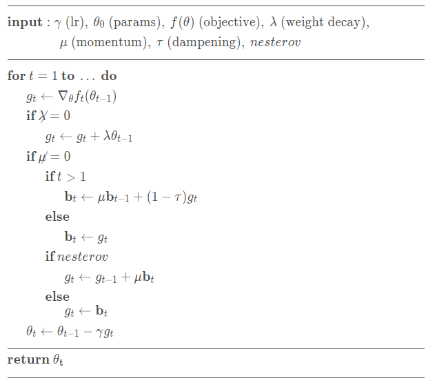
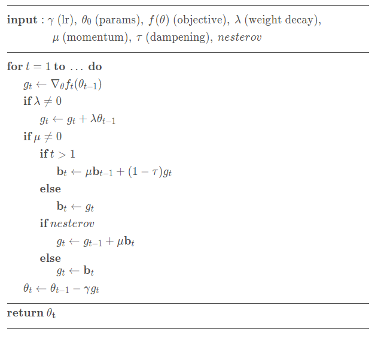

# 让docsify支持LaTeX

> [使用docsify并定制以使它更强大](https://www.cnblogs.com/aopstudio/p/10732512.html)

## 支持LaTex数学公式

这里用[KaTeX](https://katex.org/)来实现通过`docsify`在`markdown`中使用`LaTeX`。

> [Mathjax和katex的功能比较（VSCode+MPE）](https://zhuanlan.zhihu.com/p/381263375)

### 1. 首先引入`katex.js`

在`index.html`的`head`里添加

``` html
<link href="https://cdn.bootcss.com/KaTeX/0.10.0/katex.min.css" rel="stylesheet">
<script src="https://cdn.bootcss.com/KaTeX/0.10.0/katex.min.js"></script>
```

或者

bootcss cdn

``` html
<link href="https://cdn.jsdelivr.net/npm/katex@0.11.1/dist/katex.css" rel="stylesheet" integrity="sha384-bsHo4/LA+lkZv61JspMDQB9QP1TtO4IgOf2yYS+J6VdAYLVyx1c3XKcsHh0Vy8Ws" crossorigin="anonymous">
<script defer src="https://cdn.jsdelivr.net/npm/katex@0.11.1/dist/katex.js" integrity="sha384-4z8mjH4yIpuK9dIQGR1JwbrfYsStrNK6MP+2Enhue4eyo0XlBDXOIPc8b6ZU0ajz" crossorigin="anonymous"></script>
```

**上面的bootcss cdn不太稳定，建议使用第二个jsdelivr cdn**

bootcss cdn的显示效果，可以看到不等号渲染错位了：



jsdelivr cdn的显示效果：



### 2. 自定义markdown配置

可以参考[支持 mermaid](https://docsify.js.org/#/zh-cn/markdown?id=%e6%94%af%e6%8c%81-mermaid)。

让Markdown渲染器把LaTeX当作一门编程语言来渲染，因此需要将公式用`` ```tex ``` ``进行包围。

配置需要在`index.html`的body里添加

``` html
<script>
    // 使docsify支持在markdown里渲染LaTeX
    markdown: {
        renderer:{
            code: function(code, lang) {
                if (lang === "tex") {
                    return (
                        '<span class="tex">'+ katex.renderToString(code, {throwOnError: false})+'</span>'
                        );
                    }
                    return this.origin.code.apply(this, arguments);
                }
            }
        }
    }
<script>
```

然后就能在markdown里使用LaTeX了。

在markdown里使用LaTeX时，记得要像[Markdown 代码语法](https://markdown.com.cn/basic-syntax/code.html)一样，在第一行添加上`` ``` tex  ``，最后一行添加上`` ``` ``，没法使用`$$ $$`包含。（VSCode使用的`Mathjax`好像可以直接用`$$ $$`，没有深入了解过。）

---

**例**：（上面演示不等号的LaTeX）

    ``` tex
    \begin{aligned}
        &\rule{110mm}{0.4pt}                                                                 \\
        &\textbf{input}      : \gamma \text{ (lr)}, \: \theta_0 \text{ (params)}, \: f(\theta)
            \text{ (objective)}, \: \lambda \text{ (weight decay)},                          \\
        &\hspace{13mm} \:\mu \text{ (momentum)}, \:\tau \text{ (dampening)},\:nesterov\\[-1.ex]
        &\rule{110mm}{0.4pt}                                                                 \\
        &\textbf{for} \: t=1 \: \textbf{to} \: \ldots \: \textbf{do}                         \\
        &\hspace{5mm}g_t           \leftarrow   \nabla_{\theta} f_t (\theta_{t-1})           \\
        &\hspace{5mm}\textbf{if} \: \lambda \neq 0                                           \\
        &\hspace{10mm} g_t \leftarrow g_t + \lambda  \theta_{t-1}                            \\
        &\hspace{5mm}\textbf{if} \: \mu \neq 0                                               \\
        &\hspace{10mm}\textbf{if} \: t > 1                                                   \\
        &\hspace{15mm} \textbf{b}_t \leftarrow \mu \textbf{b}_{t-1} + (1-\tau) g_t           \\
        &\hspace{10mm}\textbf{else}                                                          \\
        &\hspace{15mm} \textbf{b}_t \leftarrow g_t                                           \\
        &\hspace{10mm}\textbf{if} \: nesterov                                                \\
        &\hspace{15mm} g_t \leftarrow g_{t-1} + \mu \textbf{b}_t                             \\
        &\hspace{10mm}\textbf{else}                                                   \\[-1.ex]
        &\hspace{15mm} g_t  \leftarrow  \textbf{b}_t                                         \\
        &\hspace{5mm}\theta_t \leftarrow \theta_{t-1} - \gamma g_t                    \\[-1.ex]
        &\rule{110mm}{0.4pt}                                                          \\[-1.ex]
        &\bf{return} \:  \theta_t                                                     \\[-1.ex]
        &\rule{110mm}{0.4pt}                                                          \\[-1.ex]
    \end{aligned}
    ```

``` tex
\begin{aligned}
    &\rule{110mm}{0.4pt}                                                                 \\
    &\textbf{input}      : \gamma \text{ (lr)}, \: \theta_0 \text{ (params)}, \: f(\theta)
        \text{ (objective)}, \: \lambda \text{ (weight decay)},                          \\
    &\hspace{13mm} \:\mu \text{ (momentum)}, \:\tau \text{ (dampening)},\:nesterov\\[-1.ex]
    &\rule{110mm}{0.4pt}                                                                 \\
    &\textbf{for} \: t=1 \: \textbf{to} \: \ldots \: \textbf{do}                         \\
    &\hspace{5mm}g_t           \leftarrow   \nabla_{\theta} f_t (\theta_{t-1})           \\
    &\hspace{5mm}\textbf{if} \: \lambda \neq 0                                           \\
    &\hspace{10mm} g_t \leftarrow g_t + \lambda  \theta_{t-1}                            \\
    &\hspace{5mm}\textbf{if} \: \mu \neq 0                                               \\
    &\hspace{10mm}\textbf{if} \: t > 1                                                   \\
    &\hspace{15mm} \textbf{b}_t \leftarrow \mu \textbf{b}_{t-1} + (1-\tau) g_t           \\
    &\hspace{10mm}\textbf{else}                                                          \\
    &\hspace{15mm} \textbf{b}_t \leftarrow g_t                                           \\
    &\hspace{10mm}\textbf{if} \: nesterov                                                \\
    &\hspace{15mm} g_t \leftarrow g_{t-1} + \mu \textbf{b}_t                             \\
    &\hspace{10mm}\textbf{else}                                                   \\[-1.ex]
    &\hspace{15mm} g_t  \leftarrow  \textbf{b}_t                                         \\
    &\hspace{5mm}\theta_t \leftarrow \theta_{t-1} - \gamma g_t                    \\[-1.ex]
    &\rule{110mm}{0.4pt}                                                          \\[-1.ex]
    &\bf{return} \:  \theta_t                                                     \\[-1.ex]
    &\rule{110mm}{0.4pt}                                                          \\[-1.ex]
\end{aligned}
```

---

注：上文中在代码块中显示`` ` ``反引号的技巧是：

1. 行内：[转义反引号](https://markdown.com.cn/basic-syntax/code.html#%E8%BD%AC%E4%B9%89%E5%8F%8D%E5%BC%95%E5%8F%B7)，通过连续两个反引号框住的字符里，反引号能够正常显示。
   
2. 行间：Markdown基本语法允许通过将行缩进四个空格或一个制表符来创建代码块。再在第一行写上`` ``` ``。
   
   图中warning是markdown lint语法检测。
